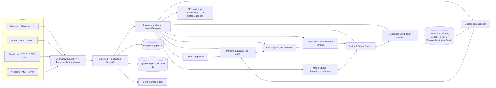

# Plan: a Nextrium product, name TBD: one context in, content for every platform out

> "Echo" below is only a placeholder. The real name is chosen in Phase 0, step 0 (brand-conflict check), before anything public is registered.

## Context

**The problem.** Skilled people (engineers, designers, founders) and people who just want to make others smile or teach them something don't post. The reasons are rarely about skill:
- they don't know what to say, or think "it's not impressive enough"
- they have no time, and every platform wants a different format
- they have no visuals, and above all no video, camera or editing skills
- they fear judgment (imposter syndrome, perfectionism)
- their work is invisible: shipped features sit in repos, knowledge sits in their heads

**The product.** A consumer app and a B2B API. It:
1. Takes context from anywhere: automatically (GitHub/GitLab repos and releases, blogs, docs, RSS, Notion, PDFs, voice notes, URLs) or typed by hand.
2. Learns who the person is: expertise, interests, voice, and *why they haven't posted*.
3. Turns one context into posts made for each platform (LinkedIn, X, Instagram, Facebook, Threads, TikTok, YouTube Shorts, Bluesky, Mastodon, Dev.to/Medium), in any mode: casual/fun, educational, expert opinion, build-in-public.
4. Makes images, carousels and **realistic video with no footage** (faceless explainers and a consented AI avatar of the user).
5. Publishes or schedules within each platform's rules, reads responses where the APIs allow it, and learns from them.
6. Can run on its own ("autopilot") but asks for approval by default.

**Hard constraints:**
- Profitable at **$1–$10/month** consumer tiers.
- Every action allowed by each platform's policy.
- Enterprise-ready: multi-tenant, SSO, audit logs, API keys, webhooks, SLAs.
- Launch globally, with African payments and pricing handled.

**Decisions made:**
- Global launch with Africa-aware pricing and payments.
- TypeScript end-to-end, with Python only in GPU workers.
- **All platform groups at MVP.**
- **Both video paths at MVP.**

---

## 1. Platform policy matrix (drives the product limits)

> Based on my knowledge as of mid-2026. **Phase 0, task 1 re-checks every row against the official docs** and stores the results as machine-readable rules in `packages/policy/rules/*.yaml`. Rules are data, not code, so a policy change is a config update, not a redeploy.

| Platform | Publish via API | Read responses | Key limits and gates | Workaround / design response |
|---|---|---|---|---|
| **LinkedIn (personal)** | Yes: "Share on LinkedIn" / Posts API (`w_member_social`), self-serve | **No**: `r_member_social` is closed to most apps | No scraping (ToS); rate limits per member/app | Publish via API. For learning, use the user's own analytics export (CSV upload) and manual paste of top comments. |
| **LinkedIn (company page)** | Yes: Community Management API (needs approval, dev → standard tier) | Yes: comments and analytics on org posts | Needs vetting, a business entity and a privacy policy | Apply in Phase 0. B2B customers get the full loop on pages. |
| **X** | Yes, paid: free tier is write-only with a tiny monthly cap; Basic/Pro/pay-per-use for more | Paid tiers only | Expensive. Automation rules ban spam, duplicate posts and automated @replies | (a) Platform key on a paid tier, with X usage metered as credits. (b) **BYO X developer key** for power users and B2B. (c) Free fallback: "open in X" web intent with the text pre-filled. Never auto-reply. |
| **Instagram** | Yes: Graph API with Instagram Login. Images, carousels, Reels, Stories. **Business/Creator accounts only** | Yes: comments and insights (`instagram_business_manage_comments`) | Meta App Review plus Business Verification; daily cap on API-published posts per account | Onboarding helps the user switch to a free Creator account. Personal accounts get "export + push notification to post". |
| **Facebook Pages** | Yes: Pages API | Yes | Same Meta app review | The same Meta app covers IG, FB and Threads. |
| **Threads** | Yes: Threads API (text, image, video, carousel) | Yes: replies and insights | Daily post/reply caps | Full loop. |
| **TikTok** | Content Posting API. **Posts from unaudited apps are private (SELF_ONLY) until the audit passes.** Direct Post or Upload-to-Inbox (draft) | **No** general comment read (Research API is academic-only) | Required UX: preview, the user picks privacy, commercial-content disclosure toggle, no added watermarks, **AI-generated content label** | Upload-to-Inbox (draft) until the audit passes, then Direct Post. Learning comes from the Display API plus manual comment paste. |
| **YouTube Shorts** | Data API v3 `videos.insert`. **Unverified projects' uploads are locked private** until audit; upload costs ~1,600 of 10k daily quota units | Yes: `commentThreads` (cheap) | Quota-bound. "Altered or synthetic content" disclosure required for realistic AI | Request a quota increase and audit in Phase 0. Set `containsSyntheticMedia`. |
| **Bluesky** | Yes: AT Protocol, open and free | Yes: full | Label AI content, respect rate limits | Full loop at zero API cost. Offered like any other platform, never pushed. |
| **Mastodon** | Yes: open API per instance | Yes | Instance rules vary; bot accounts must be flagged | Full loop. |
| **Dev.to / Medium / Hashnode** | Dev.to and Hashnode APIs: yes. Medium: API closed to new integrations | Dev.to comments: yes | — | Long-form canonical post, cross-linked from the short posts. Medium gets export/import-by-URL. |

**Cross-platform rules the policy engine enforces:**
- **AI disclosure:**
  - Meta "AI info", TikTok AIGC label and YouTube synthetic-media flag set automatically on AI visuals.
  - C2PA Content Credentials embedded in every generated image and video.
  - EU AI Act Art. 50 transparency duties apply from Aug 2026, so deepfake-style content is always labeled.
- **Likeness and consent:**
  - Avatars only of the *verified account owner*: liveness check plus a recorded consent script.
  - No other real people, no celebrities, no voice cloning of others.
  - Consent can be revoked, which deletes the model.
- **Authentic behavior:**
  - No fake engagement, no auto-follow, like or DM, and no automated replies without human approval.
  - No near-duplicate posts across accounts (X/Meta spam rules): variants are genuinely reworded.
- **Content policy:** moderation pass on every output (hate, medical/financial claims, IP, misinformation). Brand-safety presets for B2B.
- **Data:**
  - Official APIs only, never scraping.
  - Honor platform data-deletion callbacks.
  - Store tokens encrypted (KMS envelope).
  - Meta/TikTok data-use rules: platform data is not used to train shared models; each user's data only personalizes that user's model.

---

## 2. System architecture



### Services (modules in one TS monorepo, deployed as a few processes: a "modular monolith" that can be split later)

1. **Context Ingestion**: connector framework (`packages/connectors/*`). Each connector implements `fetch → normalize → chunk → embed`.
   - Sources: GitHub/GitLab (commits, PRs, releases, READMEs, stars milestones, via webhooks), RSS/blog, URL, PDF/Doc, Notion, Google Drive, voice note (speech-to-text), manual text, and CSV analytics exports.
2. **Persona & Knowledge Brain**: per-user profile graph in Postgres:
   - expertise, interests, audience, tone sliders, banned topics, goals, and a "blocker profile"
   - a voice fingerprint learned from past posts and edits
   - pgvector for retrieval
3. **Idea Engine (autonomy)**:
   - Event triggers find "post-worthy moments": merged PR, release, milestone, new blog, trending topic in the user's domain, anniversaries.
   - A scheduled "content calendar" planner mixes formats: 40% educational, 25% build-in-public, 20% opinion, 15% casual/fun (the user can tune this).
   - Every idea is scored for relevance, novelty (versus past posts) and platform fit.
4. **Composer**: one "Content Brief" (canonical context, angle, key points, CTA) becomes **platform-native variants**:
   - LinkedIn story post, X thread, IG carousel plus caption, Reel/Short/TikTok script, Threads post, Bluesky post, Dev.to article.
   - Platform constraints (length, hashtags, link placement, aspect ratios) come from the policy rules.
5. **Media Studio**:
   - **Images/carousels**: HTML/React templates rendered to PNG via Satori/resvg (near-zero cost). Diagrams via Mermaid. Code snippets via Shiki-rendered cards. AI images for illustrations only.
   - **Video path A, faceless and code explainers**:
     1. script
     2. TTS voice (the user's consented voice clone or a stock voice)
     3. Remotion composition: kinetic captions, animated code diffs, diagram build-ups, repo walkthroughs, stock b-roll (Pexels/Pixabay APIs), AI b-roll clips
     4. auto captions
     5. rendered on Remotion Lambda or a CPU worker
   - **Video path B, consented AI avatar**:
     - The user records a ~2-minute consent and training clip.
     - A lip-sync model on GPU (open-source such as LatentSync/MuseTalk on Modal, with a vendor API such as HeyGen/Tavus as fallback) produces a talking head.
     - It is composited with path A's graphics.
   - **Premium cinematic scenes**: text-to-video vendor APIs (Veo/Kling/Runway class), routed through a provider abstraction and charged in credits.
6. **Policy & Safety Engine**:
   - Lints each variant against the platform rules YAML.
   - Moderation (LLM classifier plus rules), claim-checking for factual/educational posts (sources attached), and disclosure labels.
   - C2PA signing and consent checks for likeness.
   - Blocks or warns before publish.
7. **Scheduler & Publisher**:
   - One adapter per platform (`packages/platforms/<name>`) implementing `publish`, `status`, `delete`, `fetchComments?` and `fetchInsights?`, with capabilities declared per adapter.
   - Token vault with refresh.
   - Per-platform rate-limit buckets.
   - Retries with idempotency keys.
   - Fallback modes: API publish → draft/inbox upload → "notify and one-tap share" (mobile share sheet or web intent).
8. **Engagement Listener**:
   - Polls or receives webhooks for comments and insights where allowed.
   - Clusters comment themes (questions, objections, praise) into interest signals.
   - Updates the Brain and suggests follow-up posts ("3 people asked how X works → explainer?").
   - Drafts **replies for approval only**.
9. **Analytics**: per-post and per-platform performance, what worked by format and topic, and a weekly "confidence report".
10. **Billing and credits**:
    - Plans plus a credit ledger (double-entry table) for metered actions (video seconds, avatar minutes, X API calls, premium generations).
    - Merchant-of-record (Paddle or Lemon Squeezy) for global cards and tax.
    - Paystack/Flutterwave for NGN/GHS/KES local payments.
    - Regional pricing through purchasing-power tiers.

### Autonomy levels (addresses *why they haven't posted*)

Onboarding includes a 2-minute "what's stopping you?" diagnostic, which maps to defaults:

| Level | Behavior |
|---|---|
| **0 · Coach** | Ideas and prompts only. For perfectionists: "here's a 20-second win". |
| **1 · Drafts** (default) | Full drafts; the user approves each post. |
| **2 · Batch approve** | A weekly plan approved in one tap. |
| **3 · Autopilot** | Publishes within the user's rules (topics, platforms, frequency, "never post about X"). Replies are never automated. |

- **User picks their platforms**: onboarding asks which accounts the user *already has or is familiar with*. Only those are connected and used. No platform is defaulted, recommended as a starting point, or required. More can be added any time.
- **Confidence ladder (platform-agnostic)**: works on whichever platforms the user chose.
  - Start in private/draft mode: drafts saved to the platform's own drafts/inbox where supported, otherwise kept in Echo.
  - Then "close friends / limited audience" options where the platform offers them.
  - Then low-frequency public posting, then the user's normal cadence.
  - The user sets the pace. Nothing moves them to other platforms.
- **Content modes**: 😊 *Smile* (casual/humor), 🎓 *Teach* (educational), 🧠 *Expert take* (opinion), 🛠 *Build in public* (from repos), 📣 *Promote* (B2B).

### Enterprise / B2B

Needed for B2B:
- **Tenancy**: Org → Workspaces → Brands → Social accounts. Row-level security in Postgres.
- **Access**: RBAC roles (owner, admin, editor, approver, viewer), multi-step approval workflows, SSO/SAML plus SCIM (WorkOS).
- **Audit**: immutable audit log.
- **Brand controls**: brand kits (logo, fonts, colors, voice guide), per-brand policy presets.
- **Developer API**:
  - Public REST API (OpenAPI 3.1) with SDKs (TS, Python) generated via Stainless/Speakeasy.
  - Webhooks (signed) and idempotency keys.
  - Usage-based metering per API key.
  - **MCP server**, so customers' AI agents can call Echo.
- **Security and compliance**:
  - Encryption at rest and in transit, KMS for tokens, secrets rotation.
  - SOC 2 Type I path (Vanta/Drata), GDPR plus Nigeria's NDPA, DPA templates.
  - Data-deletion endpoints, backups and point-in-time recovery.
- **Operations**: OpenTelemetry to Grafana/Axiom, Sentry, status page, SLOs, feature flags, and per-tenant cost dashboards.

### Core API shape (one API for everything)

```
POST /v1/contexts            # add a source (repo URL, text, file, url)
POST /v1/briefs              # create a brief from contexts (or let autopilot)
POST /v1/briefs/{id}/compose # → variants for chosen platforms
POST /v1/media               # image | carousel | video (faceless|avatar|cinematic)
POST /v1/posts               # schedule/publish variants
GET  /v1/posts/{id}/engagement
GET  /v1/insights            # learned interests, suggestions
POST /v1/autopilot           # rules for autonomous mode
Webhooks: post.published, post.failed, engagement.new, media.ready, credits.low
```

The web app uses exactly this API (dogfooding), so the consumer and B2B products never drift apart.

---

## 3. Cost model (fits $1–$10)

Principles:
- **Cheap model by default, strong model only when needed**:
  - A small, fast model (Claude Haiku 4.5) for variants, rewrites and classification.
  - A stronger model (Claude Sonnet 5) for briefs, strategy and expert pieces.
  - Prompt caching on persona and system context.
  - Batch API for non-urgent autopilot generation (about 50% cheaper).
  - Exact per-token prices are confirmed with the `claude-api` reference at build time, not guessed.
- **Generate the brief once**, then fan out cheap variants from it.
- **Render instead of generate**: templates plus Remotion cost fractions of a cent, versus dollars for text-to-video. AI video is credit-gated.
- **Caching**: embeddings, dedup of identical renders, R2 with no egress fees.
- **Serverless GPU**, scaled to zero.

Target unit costs (to validate in Phase 0 with a cost benchmark script):

| Unit | Target cost |
|---|---|
| Text post set (brief + 8 variants) | ≤ $0.01 |
| Carousel/image set (templated) | ≤ $0.005 |
| Faceless 30–60s video | ≤ $0.10 |
| Avatar 30s video (self-hosted lip-sync) | ≤ $0.30 |
| Cinematic AI video, per second | vendor price + margin, **credits only** |
| X API | pass-through credits, or BYO key |

---

## 4. Business plan (summary; full version is a Phase 0 deliverable)

**Pricing** (USD; regional PPP pricing roughly 40–60% lower in Africa, South Asia and LATAM):

| Tier | Price | For | Includes |
|---|---|---|---|
| Free | $0 | Try it | 3 connected platforms, 15 text posts/mo, templated images, 2 faceless videos, Echo watermark on video end card only, open platforms + share-intent |
| Starter | $3/mo | Casual creators | All platforms, 60 posts/mo, 10 faceless videos, 1 repo/source auto-watch |
| Creator | $6/mo | Experts / devs | Unlimited text, 30 faceless + 5 avatar videos, autopilot, engagement insights, 5 sources |
| Pro | $10/mo | Power users / solo founders | Everything, 20 avatar videos, 3 brands, BYO X key, API access (1k calls) |
| Credits | $1 = N credits | Anyone | Cinematic video, extra avatar minutes, X API usage |
| Team / B2B | $10/seat + usage | Agencies, startups, DevRel teams | SSO, approvals, brand kits, audit, SLA |
| API | Usage-based | Developers / SaaS | Per brief, variant, render and video-second, volume discounts |

**Target gross margin:** ≥ 70% on subscriptions. The main risk is heavy video usage; hard caps and credits prevent losses.

**Go-to-market:**
- **Dogfood**: Echo markets itself with its own content.
- **Developer wedge**: "turn your commits into posts". Launch on GitHub Marketplace (GitHub App), Product Hunt, Hacker News and Dev.to.
- **Africa tech communities** and university ambassador programs.
- **Creator referral program**: credits for referrals.
- **B2B DevRel**: companies turn changelogs into social posts through the API.
- **Agency white-label** later.

**Moats:**
- The personal voice and knowledge graph.
- The repo-to-content pipeline.
- The policy engine, which is kept up to date as platform rules change.
- Low cost through template-first rendering.
- The engagement learning loop.

**Key risks and mitigations:**

| Risk | Mitigation |
|---|---|
| Platform API changes or price hikes (X especially) | Adapter abstraction, BYO keys, share-intent/draft fallback on every platform, so the user's chosen platforms always work in some mode |
| App review delays | Start all reviews in week 1 of the build; launch with draft/inbox modes |
| Misuse of deepfakes | Owner-only verified likeness, C2PA, labels, abuse reporting |
| Model/vendor costs | Provider abstraction, benchmark-driven routing |

**KPIs:**
- Activation: first post published within 10 minutes.
- Weekly posting streak.
- Retention: D30, M3.
- Cost per active user < $0.60/mo.
- Free → paid conversion ≥ 4%.

---

## 5. Repository layout (Turborepo + pnpm, TypeScript)

```
apps/
  web/            Next.js 15 app (consumer + B2B dashboard), PWA
  api/            Hono REST API + OpenAPI + webhooks + MCP server
  worker/         Inngest workflow functions (ingest, compose, publish, listen)
  renderer/       Remotion video compositions + Satori image templates
  gpu/            Python (Modal) - TTS, lip-sync avatar, speech-to-text
  docs/           Public API docs (Mintlify/Fumadocs)
packages/
  db/             Drizzle schema, migrations, RLS policies
  core/           domain logic: briefs, variants, autonomy, credits
  llm/            model router, prompts, caching, evals
  connectors/     github, gitlab, rss, url, pdf, notion, gdrive, voice, manual, csv
  platforms/      linkedin, x, instagram, facebook, threads, tiktok, youtube, bluesky, mastodon, devto
  policy/         rules/*.yaml + linter + moderation + disclosure/C2PA
  media/          provider abstraction for image/video/tts vendors
  billing/        plans, credit ledger, paddle/lemonsqueezy/paystack adapters
  sdk-ts/         generated SDK (published as @nextrium/<name>)
  ui/             shared design system (shadcn/ui)
infra/            Terraform/Pulumi, Docker, GitHub Actions CI/CD
blueprint/        architecture docs, diagrams, business plan (Phase 0 deliverable)
```

**Infrastructure:**
- Postgres (Neon) with pgvector, Redis (Upstash), Inngest (durable workflows).
- Cloudflare R2 plus CDN.
- Vercel (web) and Fly.io/Railway (api and worker).
- Modal (GPU), Remotion Lambda (render).
- WorkOS (SSO), Clerk or Better-Auth (consumer auth).
- Sentry, Axiom/Grafana.

---

## 6. Build phases

Everything is in the MVP, as you chose. Phase 0 is mandatory because platform approvals take weeks.

**Phase 0: Setup, name, blueprint and approvals (weeks 1–2)**

**Step 0: Project setup and naming (day 1–3, before anything else)**
- **Folder**: `C:\Users\Admin\Desktop\nextrium\<product-slug>`.
  - A sibling of `kovalio`, never inside it.
  - It starts under a neutral temporary slug (e.g. `nextrium-social`) and is renamed once the name is final.
- **GitHub from the start**:
  - `git init`, then create a **private repo under the `nextrium` GitHub organization** via `gh repo create nextrium/<slug> --private`.
  - Set up branch protection on `main`, CODEOWNERS, PR template, Dependabot, secret scanning, and a GitHub Actions CI skeleton.
  - Prerequisite: `gh auth status` shows an account with repo-create rights in the `nextrium` org. If not, you run `gh auth login` (I can't do the login for you).
- **Product GitHub App**: register the GitHub App (the "connect your repos" feature) under the `nextrium` org from the start, so the repo-to-content pipeline is built against the real app.
  - The webhook secret and private key are stored in the secrets manager, never in the repo.
  - You create it in GitHub org settings; I prepare the manifest and permission list.
- **Naming research** (deliverable: a shortlist of 5–10 names with a conflict report):
  - Trademark searches: USPTO, EUIPO, WIPO Global Brand Database, Nigeria trademark registry.
  - Domain availability: .com, .ai, .app, .io.
  - Handle availability on all 10 target platforms, plus the GitHub org or repo name.
  - App Store / Play Store name conflicts.
  - Existing products in the social-media/AI-content space with similar names.
  - Fit with the Nextrium brand family: "<Name> by Nextrium".
  - **You pick the name.** Then the repo, folder, package scope (`@nextrium/*`), domains and handles are renamed or registered.
  - Platform developer apps are registered only after the name is chosen, because app review shows the name.

1. Verify every row of the policy matrix against the official docs, then write `packages/policy/rules/*.yaml` and `blueprint/platform-policies.md`.
2. Publish the **Blueprint artifact**: architecture diagrams (C4 context, container and sequence diagrams for ingest→publish and engagement→learn), data model ERD, threat model, cost model spreadsheet, full business plan.
3. Start the app registrations and reviews: Meta (IG/FB/Threads plus Business Verification), LinkedIn (Share plus Community Management), TikTok (Content Posting audit), YouTube (quota and audit), X (dev account). Needs: a company entity, domain, privacy policy, ToS and demo video.
4. Cost benchmark script: real per-unit costs for the LLM, TTS, lip-sync and render.

**Phase 1: Foundation (weeks 2–4)**
- Monorepo, CI/CD, database schema plus RLS, auth and orgs, API skeleton with OpenAPI, the credit ledger, observability.

**Phase 2: Brain and composer (weeks 4–7)**
- Connectors: GitHub, URL, RSS, PDF, manual, voice.
- Persona onboarding with the blocker diagnostic.
- Brief → variants for all 10 platforms.
- Policy linter and moderation.
- Image and carousel templates.

**Phase 3: Publishing (weeks 6–9)**
- All platform adapters with capability flags and fallbacks.
- Scheduler, calendar UI, approval flows.

**Phase 4: Video (weeks 7–11)**
- Path A: faceless and code explainers (Remotion).
- Path B: consent and liveness flow plus the self-hosted avatar lip-sync, with a vendor fallback.
- Premium cinematic scenes via the vendor abstraction, paid with credits.
- C2PA signing and disclosure labels.

**Phase 5: Autonomy and learning (weeks 10–13)**
- Idea Engine triggers, autopilot rules, Engagement Listener, insights, analytics.

**Phase 6: Business and enterprise (weeks 12–15)**
- Billing: Paddle/Lemon Squeezy plus Paystack, PPP pricing.
- SSO/SCIM, audit log, brand kits.
- Public API docs and SDKs, webhooks, MCP server.

**Phase 7: Hardening and launch (weeks 15–17)**
- Load tests, security review and penetration test, backups and disaster-recovery drill, SOC 2 readiness, status page.
- Beta cohort, then public launch.

---

## 7. Verification

- **Unit and contract tests**: every platform adapter runs against recorded fixtures and the platform sandboxes/test users (Meta test users, TikTok sandbox, LinkedIn dev app, Bluesky test account). Policy rules have golden tests: each rule has pass and fail examples.
- **LLM evals**: an eval set of about 50 real contexts (repos, articles, notes). The LLM grades voice match, factuality, platform fit and policy compliance; the build fails on regression. Cost per run is tracked.
- **End-to-end (Playwright)**:
  1. Sign up and take the diagnostic.
  2. Pick platforms (the test matrix covers each platform, alone and in combination; nothing is preselected).
  3. Connect GitHub and the chosen platforms.
  4. Merge a test PR.
  5. An idea appears.
  6. Approve it.
  7. Posts are published or drafted on each chosen platform's test account.
  8. A reply is ingested where the platform's API allows it.
  9. An insight appears.
  - Also assert that onboarding never preselects or promotes a platform.
- **Video**: render golden faceless and avatar samples, then check duration, captions, C2PA manifest and label metadata.
- **Billing**: Paddle/Paystack sandbox webhooks. The credit ledger always balances (checked by a property test).
- **Load**: k6 at 1k concurrent composes and 10k scheduled publishes per hour. Per-user cost is checked against the targets in section 3.
- **Security**: OWASP ASVS checklist, a tenant-isolation test suite, and a secrets scan in CI.

## First action after approval

1. Check `gh auth status` for `nextrium` org access.
2. Create `C:\Users\Admin\Desktop\nextrium\nextrium-social` (temporary slug) and the private repo `nextrium/nextrium-social`, with CI, branch protection and the monorepo skeleton committed.
3. Run the naming and brand-conflict research. Present the shortlist for you to choose from.
4. Run Phase 0 tasks 1, 2 and 4 (policy check, blueprint, cost benchmark). Publish the Blueprint and business plan as a shareable page.
5. After the name is chosen: rename the repo and folder, then hand you the list of registrations only you can do: company entity, domains, platform developer accounts, the GitHub App in org settings, payment accounts.
